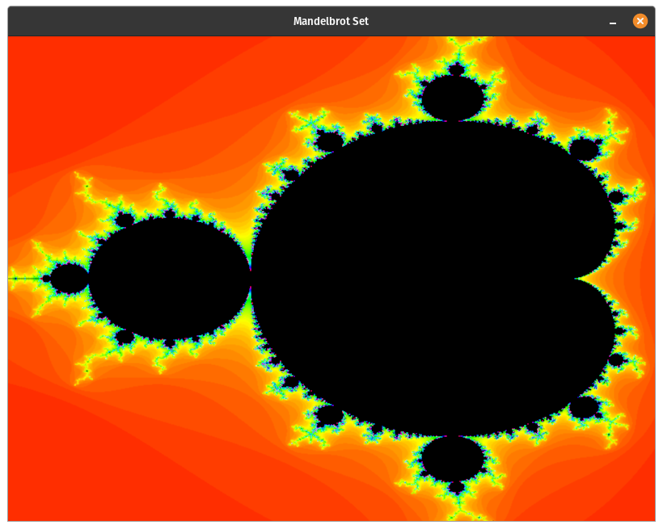
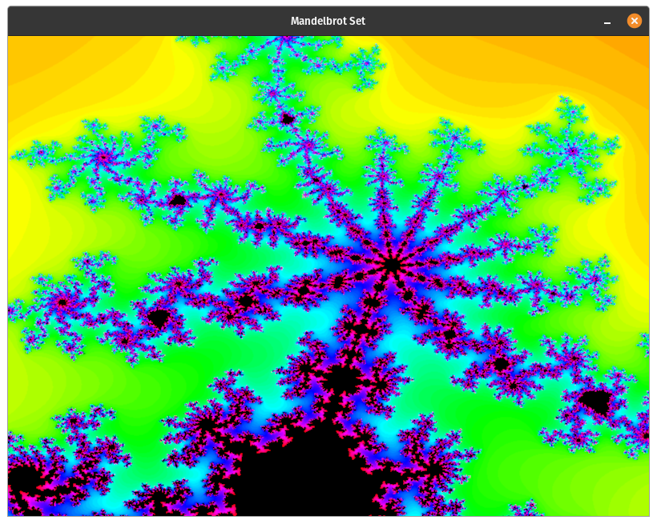

# Mandelbrot Viewer in OpenGl
###Controls:
- Zoom- Hold and drag the mouse to select an area.
- Reset Selection- Esc
- Go back- B
- Reset- R
- Exit- q

###Upcoming features
- Rendering with the GPU
- (Maybe Multithreading)